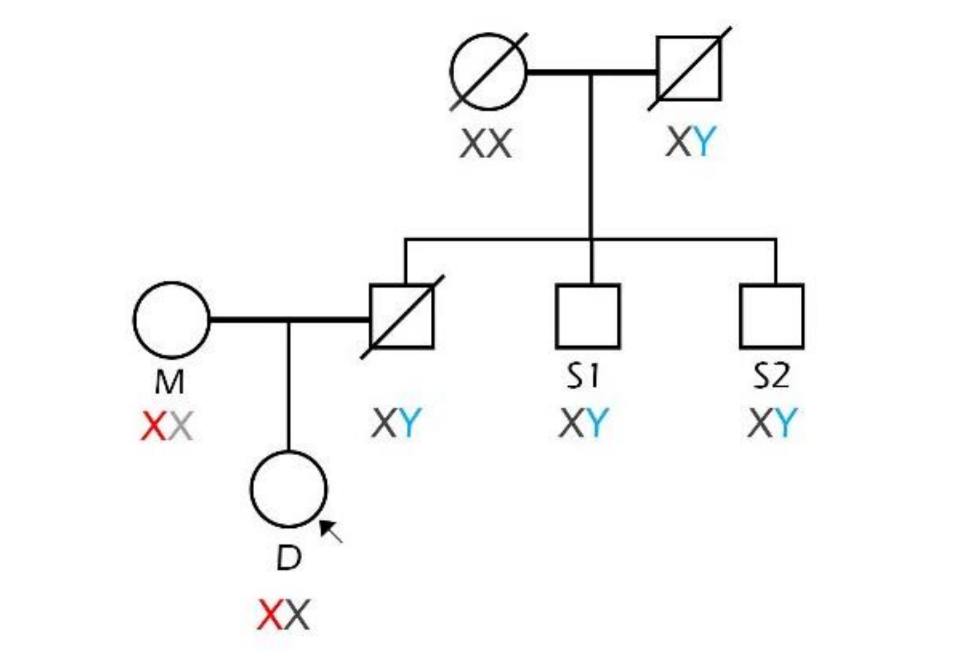

## Zadanie 3 (5b)

V tomto zadaní budete pracovať s nástrojom FamLinkX a datasetom **dna_screening_zadanie** dostupným v priečinku `inputs`. 

Dataset obsahuje údaje matky, dcéry a dvoch strýkov, ktorí sú bratmi muža, u ktorého predpokladáme, že je otcom dcéry. Je potrebné potvrdiť alebo vyvrátiť či bol muž otcom dievčaťa. Pomocou nástroja FamLinkX zostavte hypotézy s rodokmeňom členov, vykonajte analýzu, určte výsledné pravdepodobnosti hypotéz a uveďte výsledné rozhodnutie na potvrdenie/zamietnutie otcovstva.

### Úloha 1 (1b)

**Formulujte hypotézy pre riešenie úlohy:**

H0 - Muž je biologickým otcom dcéry
HA - Muž nie je biologickým otcom dcéry

### Úloha 2 (4b)

Vykonajte analýzu pomocou nástroja FamLinkX. Ako referenčnú databázu použite Českú alebo Nemeckú databázu. Ako prílohu zadania odovzdajte vygenerovaný report z analýzy (Case report vo formáte .rtf).
**Uveďte LR a pravdepodobnosť (W) pre jednotlivé hypotézy a Váš záver analýzy:**

- LR = 7042640
- W = 0.99999986
- H0 = 99,999986%
- HA = 0,0000139%
- Pravdepodobnosť hypotézy H0 je 99,999986% a hypotézy HA je 0,0000139%
- H0 hovori, ze treti brat je otcom dcery s pravdepodobnostou 99,999986%